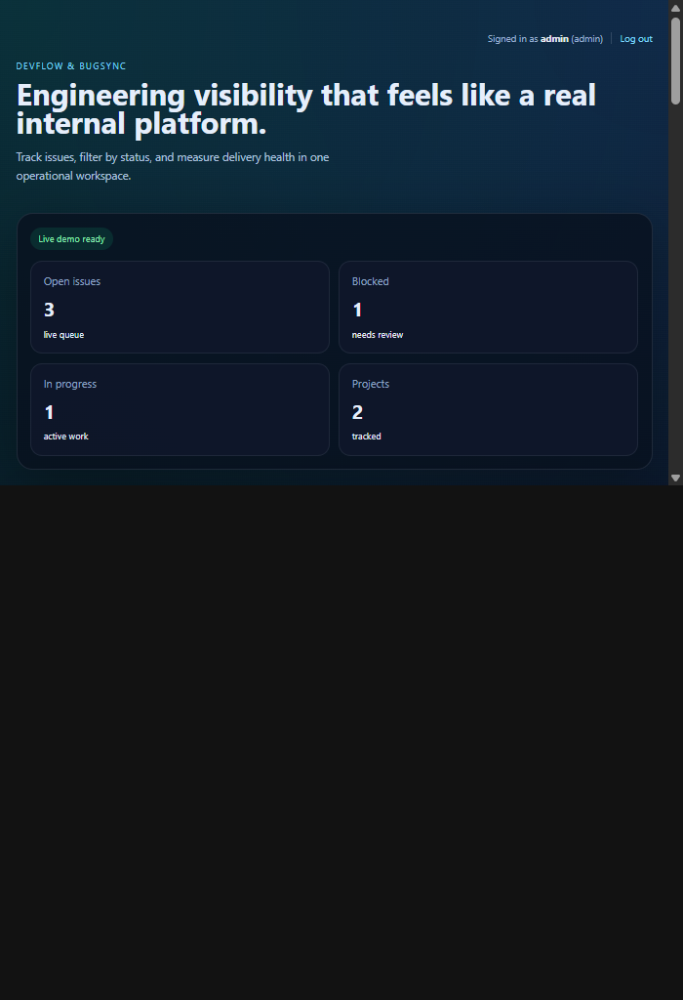
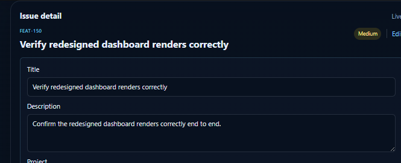
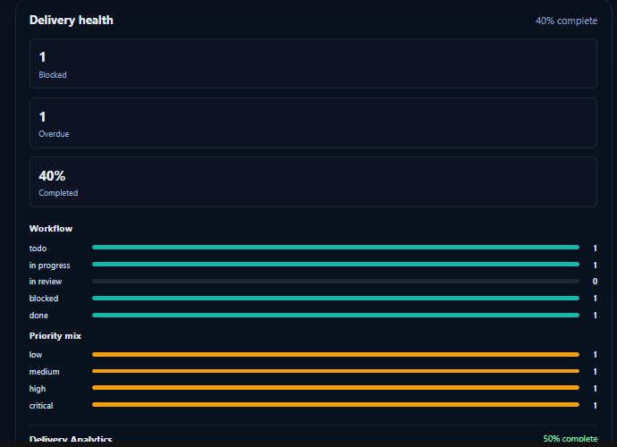
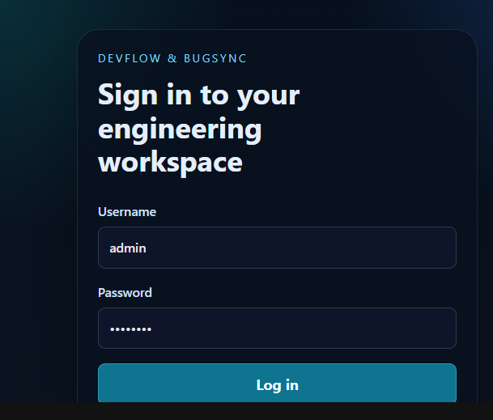

# DevFlow & BugSync

DevFlow & BugSync is an internal engineering workspace for tracking issue delivery, team workload, and release risk. It combines a scoped issue queue with delivery-health analytics, staff account management, and an audit timeline for workflow changes.

## Highlights

- Session-authenticated React dashboard backed by Django REST Framework.
- Team-scoped issue access for regular users and full organization access for staff.
- Search, status and priority filters, issue creation, assignment, and complete issue editing.
- Activity history for creation, status, assignee, title, description, priority, project, and due-date changes.
- Delivery-health analytics for workflow distribution, priority mix, workload, project completion, blocked work, and overdue work.
- Staff-only team management that creates a Django login account and linked product profile together.

## Screenshots

**Dashboard, issue queue, activity feed, delivery health, and team workload**



**Editing an issue's title, description, project, priority, due date, and assignee**



**Delivery-health analytics: workflow distribution, priority mix, and project completion**



**Session-authenticated sign-in**



## Stack

- Backend: Django 5, Django REST Framework, django-filter, drf-spectacular.
- Frontend: React 18, TypeScript, Vite.
- Database: SQLite for local development, PostgreSQL supported through Docker Compose.

## Architecture

```text
React + Vite container (localhost:5173)
		  |
		  | session cookie + CSRF token
		  v
Django REST API container (localhost:8000/api)
		  |
		  v
PostgreSQL container
```

The Django `User` is the authentication account. A `TeamMember` is the application profile linked one-to-one to a user and used for issue assignment and scoped visibility.

## Run With Docker

Prerequisite: [Docker Desktop](https://www.docker.com/products/docker-desktop/) running with Linux containers enabled.

```powershell
git clone <your-repository-url>
cd devflow-tracker
Copy-Item .env.example .env
docker compose up --build
```

Compose starts PostgreSQL, runs Django migrations, and exposes the backend and frontend with source-mounted development servers. Open the dashboard at http://localhost:5173 and API documentation at http://localhost:8000/api/docs/.

In a second terminal, create the demo records and an optional admin account:

```powershell
docker compose exec backend python manage.py seed_demo_data
docker compose exec backend python manage.py createsuperuser
```

To run the stack in the background or stop it:

```powershell
docker compose up --build -d
docker compose down
```

The `postgres_data` and `frontend_node_modules` Docker volumes retain their data between restarts. To reset all local container data, run `docker compose down --volumes`.

## Demo Flow

1. Sign in with the superuser you created, or use the existing local demo account `admin` / `admin123` when available.
2. Create a new issue, assign it, and change its status.
3. Open the issue detail panel to edit title, priority, due date, project, or description.
4. Check the activity feed and delivery-health panel to see the workflow updates reflected in the product.
5. As staff, use **Team workload** to create a member and their frontend login account.

## Access Model

- Staff users can see all work, manage member accounts, and access Django Admin at http://localhost:8000/admin/.
- Team members see issues assigned to them or in projects they own.
- To switch frontend users, use the dashboard **Log out** control. Django Admin shares the same backend session, so use a private browser window or separate profile when testing two accounts simultaneously.

## Deployment

The repo is configured to deploy as two services: a Django API and a static frontend build.

- [render.yaml](render.yaml) defines both services plus a managed Postgres database for one-click deployment on [Render](https://render.com).
- [backend/Procfile](backend/Procfile) works as a generic fallback for Heroku-style platforms (Railway, Heroku).
- The backend serves its own static assets via `whitenoise`, so no separate static file host is required.
- Production security settings (`SECURE_SSL_REDIRECT`, secure cookies) activate automatically when `DEBUG=0`.

To deploy on Render:

1. Push this repository to GitHub.
2. In the Render dashboard, choose **New > Blueprint** and point it at the repository. Render reads `render.yaml` and provisions the database, backend, and frontend together.
3. After the first deploy, update the backend's `ALLOWED_HOSTS`, `CORS_ALLOWED_ORIGINS`, and `CSRF_TRUSTED_ORIGINS` to match the actual generated frontend URL, and update the frontend's `VITE_API_BASE_URL` to match the actual backend URL.
4. Run `python manage.py seed_demo_data` and `python manage.py createsuperuser` from the Render shell for the backend service.

Deploying requires your own hosting account credentials, so this step has to be run by you rather than automated here.

## Environment Variables

Copy `.env.example` to `.env` for local configuration. In a deployed environment, set `DEBUG=0`, use a strong unique `SECRET_KEY`, and set `ALLOWED_HOSTS`, `CORS_ALLOWED_ORIGINS`, `CSRF_TRUSTED_ORIGINS`, and `VITE_API_BASE_URL` to the deployed URLs.

## Validation

```powershell
docker compose exec backend python manage.py test apps.core.tests
docker compose exec frontend npm run test
docker compose exec frontend npm run build
```
